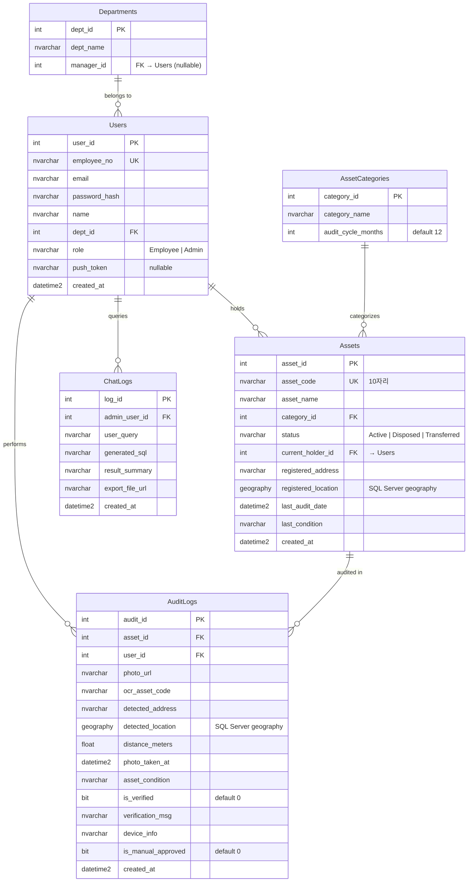

# Data Model: Company Asset Management (001-asset-management)

**Date**: 2026-03-04 (Updated)  
**Branch**: `001-asset-management`

> 아래 모델은 실제 Azure SQL Database의 스키마를 그대로 기반으로 합니다.  
> 신규 테이블은 `ChatLogs` 1개만 추가합니다.

## Entity Relationship Diagram



## Entities (실제 DB 기준)

### Departments (기존)

조직(부서) 정보를 관리합니다.

| Column | Type | Constraints | Description |
|--------|------|-------------|-------------|
| dept_id | INT | PK, IDENTITY | 부서 ID |
| dept_name | NVARCHAR(100) | NOT NULL | 부서명 |
| manager_id | INT | NULL | 부서 관리자 (Users FK, 자기참조) |

### Users (기존)

시스템 사용자. 일반 직원(`Employee`)과 자산 관리자(`Admin`)를 role로 구분합니다.

| Column | Type | Constraints | Description |
|--------|------|-------------|-------------|
| user_id | INT | PK, IDENTITY | 사용자 ID |
| employee_no | NVARCHAR(20) | NOT NULL, UNIQUE | 사원번호 |
| email | NVARCHAR(100) | NOT NULL | 이메일 |
| password_hash | NVARCHAR(255) | NOT NULL | 해시된 비밀번호 |
| name | NVARCHAR(50) | NOT NULL | 이름 |
| dept_id | INT | FK → Departments.dept_id | 소속 부서 |
| role | NVARCHAR(20) | NOT NULL, DEFAULT 'Employee' | Employee / Admin |
| push_token | NVARCHAR(MAX) | NULL | 푸시 알림 토큰 (Post-MVP) |
| created_at | DATETIME2 | DEFAULT GETDATE() | 생성일 |

### AssetCategories (기존)

자산 분류 및 실사 주기를 관리합니다.

| Column | Type | Constraints | Description |
|--------|------|-------------|-------------|
| category_id | INT | PK, IDENTITY | 카테고리 ID |
| category_name | NVARCHAR(50) | NOT NULL | 카테고리명 (IT장비, 가구 등) |
| audit_cycle_months | INT | DEFAULT 12 | 실사 주기 (개월) |

### Assets (기존)

회사 자산. 약 600개의 기존 레코드가 존재합니다.

| Column | Type | Constraints | Description |
|--------|------|-------------|-------------|
| asset_id | INT | PK, IDENTITY | 자산 ID |
| asset_code | NVARCHAR(10) | NOT NULL, UNIQUE | 10자리 자산 코드 |
| asset_name | NVARCHAR(255) | NOT NULL | 자산명 |
| category_id | INT | FK → AssetCategories.category_id | 자산 분류 |
| status | NVARCHAR(20) | DEFAULT 'Active' | Active / Disposed / Transferred |
| current_holder_id | INT | FK → Users.user_id, NULL 허용 | 현재 보유자 (공용은 NULL) |
| registered_address | NVARCHAR(500) | NULL | 등록 주소 텍스트 |
| registered_location | **GEOGRAPHY** | NULL | 등록 위치 (SQL Server 공간 타입) |
| last_audit_date | DATETIME2 | NULL | 최종 실사일 |
| last_condition | NVARCHAR(50) | NULL | 최종 상태 (양호, 불량 등) |
| created_at | DATETIME2 | DEFAULT GETDATE() | 생성일 |

> ⚠️ **`registered_location`은 SQL Server `geography` 타입**입니다.  
> 거리 계산은 `registered_location.STDistance(detected_location)` SQL 함수로 수행합니다.

### AuditLogs (기존)

자산 실사 기록. 검증 결과를 `is_verified` + `verification_msg`로 관리합니다.

| Column | Type | Constraints | Description |
|--------|------|-------------|-------------|
| audit_id | INT | PK, IDENTITY | 실사 ID |
| asset_id | INT | FK → Assets.asset_id | 대상 자산 |
| user_id | INT | FK → Users.user_id | 실사 수행 직원 |
| photo_url | NVARCHAR(MAX) | NOT NULL | 촬영 사진 URL |
| ocr_asset_code | NVARCHAR(20) | NULL | OCR 추출 자산코드 |
| detected_address | NVARCHAR(500) | NULL | 사진 메타데이터 주소 |
| detected_location | **GEOGRAPHY** | NULL | 사진 GPS (공간 타입) |
| distance_meters | FLOAT | NULL | 등록 위치와의 거리(m) |
| photo_taken_at | DATETIME2 | NULL | 사진 촬영 시각 |
| asset_condition | NVARCHAR(50) | NOT NULL | 자산 상태 (양호/불량 등) |
| is_verified | BIT | DEFAULT 0 | 최종 검증 결과 |
| verification_msg | NVARCHAR(MAX) | NULL | 검증 결과 메시지 / 실패 사유 |
| device_info | NVARCHAR(255) | NULL | 촬영 기기 정보 |
| is_manual_approved | BIT | DEFAULT 0 | 수동 승인 여부 |
| created_at | DATETIME2 | DEFAULT GETDATE() | 생성일 |

### ChatLogs (🆕 신규 생성)

관리자의 NL2SQL 대화 기록입니다.

| Column | Type | Constraints | Description |
|--------|------|-------------|-------------|
| log_id | INT | PK, IDENTITY | 로그 ID |
| admin_user_id | INT | FK → Users.user_id, NOT NULL | 관리자 ID |
| user_query | NVARCHAR(MAX) | NOT NULL | 자연어 입력 |
| generated_sql | NVARCHAR(MAX) | NULL | 변환된 SQL |
| result_summary | NVARCHAR(MAX) | NULL | 결과 요약 |
| export_file_url | NVARCHAR(500) | NULL | 엑셀 다운로드 URL |
| created_at | DATETIME2 | DEFAULT GETDATE() | 생성일 |

## Foreign Key Relationships

| FK Name | From | To |
|---------|------|-----|
| FK_Users_Departments | Users.dept_id | Departments.dept_id |
| FK_Assets_Users | Assets.current_holder_id | Users.user_id |
| FK_Assets_Categories | Assets.category_id | AssetCategories.category_id |
| FK_AuditLogs_Assets | AuditLogs.asset_id | Assets.asset_id |
| FK_AuditLogs_Users | AuditLogs.user_id | Users.user_id |
| FK_ChatLogs_Users | ChatLogs.admin_user_id | Users.user_id |

## Validation Rules

| Rule | Entity | Description |
|------|--------|-------------|
| VR-001 | Assets.asset_code | 정확히 10자리, UNIQUE |
| VR-002 | AuditLogs.ocr_asset_code | Assets.asset_code와 완전 일치해야 검증 통과 |
| VR-003 | AuditLogs.distance_meters | `registered_location.STDistance(detected_location)` ≤ 3000m |
| VR-004 | AuditLogs.photo_taken_at | ABS(photo_taken_at - GETDATE()) ≤ 48시간 |
| VR-005 | AuditLogs.is_verified | VR-002 ∧ VR-003 ∧ VR-004 모두 TRUE일 때만 TRUE |
| VR-006 | Users.role | 'Employee' 또는 'Admin'만 허용 |

## geography 타입 활용 가이드

```sql
-- 포인트 생성 (위도, 경도)
DECLARE @point GEOGRAPHY = GEOGRAPHY::Point(37.5729, 126.9794, 4326);

-- 거리 계산 (미터 단위)
SELECT registered_location.STDistance(@detected) AS distance_meters
FROM Assets
WHERE asset_code = '1234567890';

-- 3km 이내 필터링
WHERE registered_location.STDistance(@detected) <= 3000
```
