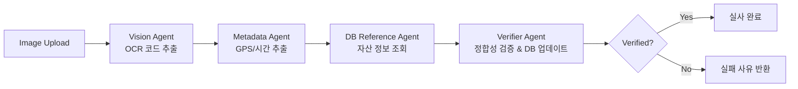
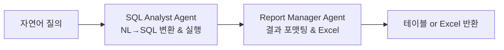

# Implementation Plan: Company Asset Management

**Branch**: `001-asset-management` | **Date**: 2026-03-04 | **Spec**: [spec.md](./spec.md)

**Note**: This plan was filled by the `/speckit.plan` command.

## Summary

KT(Korea Telecom)의 자산 관리 시스템 'Argos'를 구축합니다. 약 200명의 직원과 600개의 자산을 대상으로, 직원의 자산 자기실사(Self-Survey)와 관리자의 NL2SQL 기반 자산 조회 및 엑셀 내보내기 기능을 MVP로 구현합니다. CrewAI 프레임워크로 2개의 독립 Crew(Asset Diligence Crew, Admin Analyst Crew)를 운영하며, FastAPI 백엔드를 Docker/ACA로, React 프런트엔드를 Azure Static Web Apps로 배포합니다.

## Technical Context

**Language/Version**: Python 3.11 (Backend), TypeScript 5.x (Frontend)  
**Primary Dependencies**: FastAPI, CrewAI, SQLAlchemy, React 18, Vite, Recharts  
**Storage**: Azure SQL Database (기존 스키마: Users, Assets, AuditLogs, Departments, AssetCategories + ChatLogs 신규 생성 완료). 위치 데이터는 `geography` 공간 타입 사용, 거리 계산은 `STDistance()` SQL 함수 활용. Azure Blob Storage (`argosstphotos/asset-photos`)로 실사 사진 및 Excel 파일 저장.  
**Testing**: pytest (Backend), Vitest + React Testing Library (Frontend)  
**Target Platform**: Azure Cloud (ACA + Azure Static Web Apps)  
**Project Type**: Web Application (SPA Frontend + API Backend + AI Agent)  
**Performance Goals**: API 응답시간 < 200ms, OCR 처리 < 5초, Excel 생성 < 5초 (10K rows)  
**Constraints**: Read-only NL2SQL, 3km/48h 실사 검증 오차범위, JWT 인증  
**Scale/Scope**: ~200 users, ~600 assets, PoC 단계 (수평 확장 미고려)

## Constitution Check

*GATE: Must pass before Phase 0 research. Re-check after Phase 1 design.*

- [x] **Code Quality**: 단일 책임 원칙 준수 - CrewAI Agent 역할 분리, FastAPI 라우터/서비스 분리, Frontend 컴포넌트 분리. ESLint + Ruff 적용 계획.
- [x] **Testing Standards**: pytest 단위/통합 테스트, Vitest 프런트엔드 테스트 계획. 핵심 비즈니스 로직(검증 로직, NL2SQL 변환) 80% 이상 커버리지 목표.
- [x] **UX Consistency**: Admin(좌: 챗봇, 우: 대시보드/결과)과 Employee(자산 목록, 실사 인터페이스) 일관된 레이아웃. 로딩/에러/성공 상태 피드백 설계.
- [x] **Performance Requirements**: API 200ms 이내, 초기 로딩 최적화 (코드 스플리팅), 이미지 업로드 스트리밍 처리.

## Project Structure

### Documentation (this feature)

```text
specs/001-asset-management/
├── plan.md              # This file
├── spec.md              # Feature specification
├── research.md          # Phase 0: Technology research
├── data-model.md        # Phase 1: Data model & ER diagram
├── quickstart.md        # Phase 1: Development setup guide
├── contracts/
│   └── api-contracts.md # Phase 1: REST API contracts
└── checklists/
    └── requirements.md  # Specification quality checklist
```

### Source Code (repository root)

```text
argos_draft_v01/
├── backend/
│   ├── src/
│   │   ├── main.py                    # FastAPI app entry point
│   │   ├── config.py                  # Settings from env vars
│   │   ├── database.py                # SQLAlchemy engine/session
│   │   ├── auth/
│   │   │   ├── router.py              # /auth/login endpoint
│   │   │   ├── service.py             # JWT creation/validation
│   │   │   └── dependencies.py        # get_current_user dependency
│   │   ├── models/
│   │   │   ├── user.py                # User SQLAlchemy model
│   │   │   ├── asset.py               # Asset model
│   │   │   ├── audit_record.py        # AuditRecord model
│   │   │   └── chat_log.py            # ChatLog model
│   │   ├── api/
│   │   │   ├── assets.py              # GET /assets/my
│   │   │   ├── audit.py               # POST /audit/submit
│   │   │   └── admin.py               # POST /admin/chat, GET /admin/chat/export
│   │   ├── services/
│   │   │   ├── asset_service.py       # Asset query logic
│   │   │   ├── audit_service.py       # Audit orchestration
│   │   │   └── admin_service.py       # NL2SQL orchestration
│   │   ├── crews/
│   │   │   ├── asset_audit/
│   │   │   │   ├── crew.py            # Asset Diligence Crew config
│   │   │   │   └── agents.py          # Vision, Metadata, DB, Verifier agents
│   │   │   └── admin_analyst/
│   │   │       ├── crew.py            # Admin Analyst Crew config
│   │   │       └── agents.py          # SQL Analyst, Report Manager agents
│   │   └── tools/
│   │       ├── azure_vision_tool.py   # Azure AI Vision OCR
│   │       ├── exif_parser_tool.py    # EXIF GPS/time extraction
│   │       ├── azure_sql_tool.py      # Azure SQL read/write
│   │       ├── blob_storage_tool.py   # Azure Blob upload/SAS URL
│   │       ├── excel_export_tool.py   # openpyxl Excel generation
│   │       └── email_tool.py          # (Post-MVP) Email service
│   ├── tests/
│   │   ├── unit/
│   │   │   ├── test_exif_parser.py
│   │   │   ├── test_location_tool.py
│   │   │   └── test_audit_service.py
│   │   └── integration/
│   │       ├── test_auth_flow.py
│   │       ├── test_audit_flow.py
│   │       └── test_admin_chat.py
│   ├── Dockerfile
│   └── requirements.txt
│
├── frontend/
│   ├── src/
│   │   ├── App.tsx
│   │   ├── main.tsx
│   │   ├── api/
│   │   │   └── client.ts              # Axios/fetch wrapper
│   │   ├── auth/
│   │   │   ├── AuthContext.tsx
│   │   │   └── LoginPage.tsx
│   │   ├── components/
│   │   │   ├── Header.tsx
│   │   │   ├── Sidebar.tsx
│   │   │   └── DataTable.tsx
│   │   ├── pages/
│   │   │   ├── employee/
│   │   │   │   ├── AssetListPage.tsx   # 내 자산 목록
│   │   │   │   └── AuditPage.tsx       # 자산 실사
│   │   │   └── admin/
│   │   │       └── AdminDashboard.tsx  # 챗봇 + 대시보드
│   │   └── styles/
│   │       └── index.css
│   ├── package.json
│   └── vite.config.ts
│
├── .env
└── specs/
```

**Structure Decision**: Web Application 구조 채택 (backend/ + frontend/). CrewAI Crew는 backend/src/crews/ 하위에 역할별로 분리. 보안 원칙에 따라 Asset Diligence Crew와 Admin Analyst Crew는 별도 디렉터리로 격리.

## CrewAI Architecture

### Crew 1: Asset Diligence Crew (일반 직원용)



- **실행 방식**: Sequential (순차 실행)
- **Input**: `{image_url, employee_no, submission_time}`
- **Output**: `{"verified": true/false, "reason": "...", "asset_code": "..."}`

### Crew 2: Admin Analyst Crew (관리자용)



- **실행 방식**: Sequential (순차 실행)
- **Input**: `{admin_query}`
- **Output**: Markdown 테이블 또는 Excel 파일 URL

## Complexity Tracking

> **No Constitution Check violations detected.** 모든 원칙 준수.

## Verification Plan

### Automated Tests

1. **Backend Unit Tests** (pytest):
   ```bash
   cd backend && python -m pytest tests/unit/ -v
   ```
   - `test_exif_parser.py`: EXIF 메타데이터 추출 정확성
   - `test_location_tool.py`: Haversine 거리 계산 (3km 경계값)
   - `test_audit_service.py`: 코드일치/위치/시간 검증 로직

2. **Backend Integration Tests** (pytest):
   ```bash
   cd backend && python -m pytest tests/integration/ -v
   ```
   - `test_auth_flow.py`: 로그인 → JWT 발급 → 역할별 접근 제어
   - `test_audit_flow.py`: 이미지 업로드 → OCR → 검증 전체 파이프라인
   - `test_admin_chat.py`: NL → SQL → 결과 → Excel 전체 파이프라인

3. **Frontend Tests** (Vitest):
   ```bash
   cd frontend && npm test
   ```

### Manual Verification

1. **Employee Flow**: 브라우저에서 직원 로그인 → 자산 목록 확인 → 자산 스티커 사진 업로드 → 실사 성공/실패 결과 확인
2. **Admin Flow**: 관리자 로그인 → 챗봇에 자연어 질의 입력 → 결과 테이블 확인 → Excel 다운로드 확인
3. **Auth Guard**: 직원 계정으로 Admin 엔드포인트 접근 시 403 반환 확인
