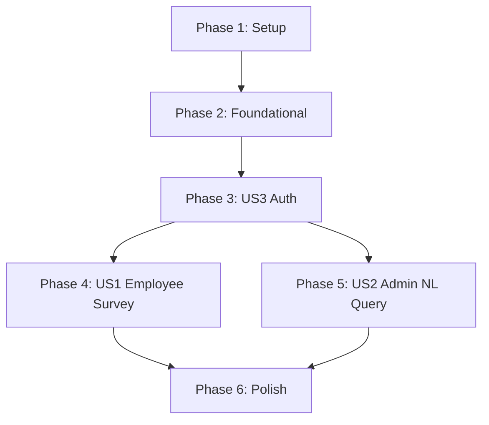

# Tasks: Company Asset Management (Argos)

**Input**: Design documents from `/specs/001-asset-management/`
**Prerequisites**: plan.md ✅, spec.md ✅, research.md ✅, data-model.md ✅, contracts/ ✅, quickstart.md ✅

**Tests**: Not explicitly requested in feature specification — test tasks are omitted.

**Organization**: Tasks grouped by user story. All 3 user stories are P1 priority but have a natural dependency order: US3 (Auth) → US1 (Employee Self-Survey) → US2 (Admin NL Query).

## Format: `[ID] [P?] [Story] Description`

- **[P]**: Can run in parallel (different files, no dependencies)
- **[Story]**: Which user story this task belongs to (US1, US2, US3)
- Paths relative to repository root (`argos_draft_v01/`)

---

## Phase 1: Setup (Shared Infrastructure)

**Purpose**: Project initialization, dependency management, and basic folder structure

- [x] T001 Create backend project structure: `backend/src/{auth,models,api,services,crews,tools}/` and `backend/tests/{unit,integration}/` per plan.md
- [x] T002 Create `backend/requirements.txt` with dependencies: fastapi, uvicorn, sqlalchemy, pyodbc, python-jose, passlib, pillow, crewai, openpyxl, azure-storage-blob, azure-ai-vision-imageanalysis, httpx, python-multipart, python-dotenv
- [x] T003 [P] Create frontend project with Vite + React + TypeScript: `frontend/` with `npm create vite@latest`
- [x] T004 [P] Create `frontend/package.json` additional dependencies: axios, react-router-dom, recharts
- [x] T005 [P] Create `.env` file at project root with all Azure credentials per quickstart.md
- [x] T006 [P] Create `backend/Dockerfile` for containerized backend deployment
- [x] T007 [P] Create `.gitignore` for Python + Node.js + .env exclusions

**Checkpoint**: Project skeleton ready, dependencies installable

---

## Phase 2: Foundational (Blocking Prerequisites)

**Purpose**: Core infrastructure that ALL user stories depend on — database connection, base models, configuration, and shared utilities

**⚠️ CRITICAL**: No user story work can begin until this phase is complete

- [x] T008 Implement environment configuration loader in `backend/src/config.py` — load all Azure SQL, OpenAI, Vision, Blob, JWT settings from .env
- [x] T009 Implement SQLAlchemy database engine and session factory in `backend/src/database.py` — connect to Azure SQL via pyodbc with ODBC Driver 18
- [x] T010 [P] Create `Users` SQLAlchemy model in `backend/src/models/user.py` — map all columns from data-model.md (user_id, employee_no, email, password_hash, name, dept_id, role, push_token, created_at)
- [x] T011 [P] Create `Departments` SQLAlchemy model in `backend/src/models/department.py` — map (dept_id, dept_name, manager_id) with relationship to Users
- [x] T012 [P] Create `AssetCategories` SQLAlchemy model in `backend/src/models/asset_category.py` — map (category_id, category_name, audit_cycle_months)
- [x] T013 [P] Create `Assets` SQLAlchemy model in `backend/src/models/asset.py` — map all columns including geography type for registered_location, relationships to Users and AssetCategories
- [x] T014 [P] Create `AuditLogs` SQLAlchemy model in `backend/src/models/audit_record.py` — map all columns including geography type for detected_location, relationships to Assets and Users
- [x] T015 [P] Create `ChatLogs` SQLAlchemy model in `backend/src/models/chat_log.py` — map (log_id, admin_user_id, user_query, generated_sql, result_summary, export_file_url, created_at)
- [x] T016 Create FastAPI app entry point in `backend/src/main.py` — initialize app, CORS middleware, include routers (auth, assets, audit, admin)
- [x] T017 [P] Create shared frontend API client with Axios interceptor in `frontend/src/api/client.ts` — base URL config, JWT token injection, error handling
- [x] T018 [P] Create frontend app shell with React Router in `frontend/src/App.tsx` — route structure for login, employee pages, admin pages
- [x] T019 [P] Create global CSS styles in `frontend/src/styles/index.css` — design system tokens, layout utilities, dark mode support

**Checkpoint**: Database connected, all models mapped, FastAPI serving, frontend routing ready — user story implementation can begin

---

## Phase 3: User Story 3 — Role-based Login and Access (Priority: P1) 🎯 MVP Foundation

**Goal**: Implement JWT authentication separating Employee and Admin roles, with role-based routing on frontend

**Independent Test**: Authenticate as Employee → confirm admin chatbot inaccessible; authenticate as Admin → confirm admin chatbot accessible and employee survey inaccessible

> **Why US3 first**: Authentication is a prerequisite for both US1 (Employee endpoints need JWT) and US2 (Admin endpoints need JWT + role check). Must be implemented before other stories.

### Implementation for User Story 3

- [x] T020 [US3] Implement JWT service in `backend/src/auth/service.py` — create_access_token (embed user_id, role, employee_no), verify_token, password hashing with passlib/bcrypt
- [x] T021 [US3] Implement auth dependencies in `backend/src/auth/dependencies.py` — get_current_user (decode JWT), require_role("Admin"), require_role("Employee")
- [x] T022 [US3] Implement POST /auth/login endpoint in `backend/src/auth/router.py` — validate employee_no + password against Users table, return JWT + user info per api-contracts.md
- [x] T023 [P] [US3] Implement AuthContext provider in `frontend/src/auth/AuthContext.tsx` — store JWT in localStorage, provide login/logout functions, expose user role
- [x] T024 [P] [US3] Implement LoginPage component in `frontend/src/auth/LoginPage.tsx` — employee_no + password form, call POST /auth/login, redirect by role
- [x] T025 [US3] Implement route guards in `frontend/src/App.tsx` — ProtectedRoute component checking role, redirect unauthenticated to login, role-based routing (Employee → /assets, Admin → /admin)
- [x] T026 [P] [US3] Create Header component in `frontend/src/components/Header.tsx` — display user name, role badge, logout button
- [x] T027 [P] [US3] Create Sidebar component in `frontend/src/components/Sidebar.tsx` — role-conditional navigation links

**Checkpoint**: Users can login, receive JWT, and are routed to role-appropriate pages. Unauthorized access returns 401/403.

---

## Phase 4: User Story 1 — Employee Asset Self-Survey (Priority: P1) 🎯 Core MVP

**Goal**: Employees view assigned assets and perform self-survey by uploading asset sticker photos with OCR verification, GPS validation (3km), and time validation (48h)

**Independent Test**: Employee logs in → views assigned assets → uploads sticker photo → system returns verified/rejected with details (code match, location, time)

### Implementation for User Story 1

#### Backend — Asset Query

- [x] T028 [US1] Implement asset query service in `backend/src/services/asset_service.py` — get_assets_by_holder(user_id) returning assets with category info
- [x] T029 [US1] Implement GET /assets/my endpoint in `backend/src/api/assets.py` — JWT-protected, returns assigned assets per api-contracts.md response schema

#### Backend — CrewAI Tools

- [x] T030 [P] [US1] Implement Azure Blob Storage tool in `backend/src/tools/blob_storage_tool.py` — upload_image(file, path) returning blob URL, generate_sas_url(blob_name)
- [x] T031 [P] [US1] Implement Azure AI Vision OCR tool in `backend/src/tools/azure_vision_tool.py` — extract_text(image_url) returning extracted strings, filter 10-digit asset code with regex
- [x] T032 [P] [US1] Implement EXIF parser tool in `backend/src/tools/exif_parser_tool.py` — extract GPS coordinates (lat, lng) and DateTimeOriginal from image using Pillow
- [x] T033 [P] [US1] Implement Azure SQL tool in `backend/src/tools/azure_sql_tool.py` — execute_read_query(sql), execute_write(sql, params) for audit record creation, STDistance() geography calculation

#### Backend — CrewAI Asset Diligence Crew

- [x] T034 [US1] Implement Asset Diligence Crew agents in `backend/src/crews/asset_audit/agents.py` — Vision Agent (OCR extraction), Metadata Agent (EXIF GPS/time), DB Reference Agent (asset lookup + distance calc), Verifier Agent (3-rule validation + DB update)
- [x] T035 [US1] Implement Asset Diligence Crew orchestration in `backend/src/crews/asset_audit/crew.py` — sequential crew: Vision → Metadata → DB Reference → Verifier, input/output schemas per plan.md

#### Backend — Audit Endpoint

- [x] T036 [US1] Implement audit orchestration service in `backend/src/services/audit_service.py` — receive image, upload to Blob, trigger Asset Diligence Crew, save AuditLog record, return verification result
- [x] T037 [US1] Implement POST /audit/submit endpoint in `backend/src/api/audit.py` — multipart/form-data (image, asset_code, asset_condition), JWT-protected Employee-only, response per api-contracts.md

#### Frontend — Employee Pages

- [x] T038 [P] [US1] Implement DataTable reusable component in `frontend/src/components/DataTable.tsx` — sortable columns, loading/empty states
- [x] T039 [US1] Implement AssetListPage in `frontend/src/pages/employee/AssetListPage.tsx` — fetch GET /assets/my, display assets in DataTable, "실사 시작" button per asset
- [x] T040 [US1] Implement AuditPage in `frontend/src/pages/employee/AuditPage.tsx` — photo capture/upload interface, display asset info, submit POST /audit/submit, show verification result (success/failure with details)

**Checkpoint**: Employee can login → view assets → upload sticker photo → see verified/rejected result with OCR code, distance, and time matching details

---

## Phase 5: User Story 2 — Admin NL Asset Query and Export (Priority: P1)

**Goal**: Admin asks natural language questions about assets/employees via chatbot, views tabular results, and exports to Excel

**Independent Test**: Admin logs in → types NL question → sees tabular result → clicks export → downloads Excel file matching displayed data

### Implementation for User Story 2

#### Backend — CrewAI Tools

- [x] T041 [P] [US2] Implement Excel export tool in `backend/src/tools/excel_export_tool.py` — generate_excel(columns, rows) using openpyxl, upload to Blob Storage at exports/{admin_user_id}/{timestamp}.xlsx, return SAS URL

#### Backend — CrewAI Admin Analyst Crew

- [x] T042 [US2] Implement Admin Analyst Crew agents in `backend/src/crews/admin_analyst/agents.py` — SQL Analyst Agent (NL→SQL via Azure OpenAI GPT-4.1, schema in system prompt, read-only enforcement), Report Manager Agent (format results as Markdown table or Excel)
- [x] T043 [US2] Implement Admin Analyst Crew orchestration in `backend/src/crews/admin_analyst/crew.py` — sequential crew: SQL Analyst → Report Manager, input: {admin_query}, output: Markdown table or Excel URL

#### Backend — Admin Endpoints

- [x] T044 [US2] Implement admin service in `backend/src/services/admin_service.py` — process_chat_query(query, admin_user_id) triggering Admin Analyst Crew, save ChatLog, return results; export_chat_log(log_id, admin_user_id) generating Excel from saved results
- [x] T045 [US2] Implement POST /admin/chat endpoint in `backend/src/api/admin.py` — JWT-protected Admin-only, request {query}, response with generated_sql, columns, rows, total_rows, log_id per api-contracts.md
- [x] T046 [US2] Implement GET /admin/chat/export/{log_id} endpoint in `backend/src/api/admin.py` — JWT-protected Admin-only, return download_url (SAS), file_name, expires_in_minutes per api-contracts.md

#### Frontend — Admin Page

- [x] T047 [US2] Implement AdminDashboard page in `frontend/src/pages/admin/AdminDashboard.tsx` — split layout: left panel (chat interface with message history), right panel (result table + export button). Chat input sends POST /admin/chat, results displayed in DataTable, export button calls GET /admin/chat/export/{log_id}

**Checkpoint**: Admin can login → ask NL questions → see SQL-generated tabular results → export to Excel → download file

---

## Phase 6: Polish & Cross-Cutting Concerns

**Purpose**: Improvements affecting multiple user stories, UX refinement, and deployment readiness

- [x] T048 [P] Add comprehensive error handling across all API endpoints — standardize error responses (401, 403, 422, 500) per api-contracts.md Common Error Responses
- [x] T049 [P] Add loading states, error toasts, and success notifications across all frontend pages — consistent UX feedback per constitution check
- [x] T050 [P] Implement responsive layout and mobile-friendly styling in `frontend/src/styles/index.css` — Employee AuditPage optimized for mobile photo capture
- [x] T051 Verify performance targets — API response < 200ms, OCR processing < 5s, Excel generation < 5s (10K rows) per plan.md Performance Goals
- [x] T052 [P] Add API documentation and OpenAPI schema validation in `backend/src/main.py` — FastAPI auto-docs at /docs
- [x] T053 [P] Create `frontend/vite.config.ts` production build config — code splitting, proxy to backend in dev mode
- [x] T054 Run quickstart.md validation — verify full setup from scratch following quickstart.md instructions

---

## Dependencies & Execution Order

### Phase Dependencies

- **Setup (Phase 1)**: No dependencies — start immediately
- **Foundational (Phase 2)**: Depends on Phase 1 completion — BLOCKS all user stories
- **User Story 3 / Auth (Phase 3)**: Depends on Phase 2 — BLOCKS US1 and US2 (they need JWT)
- **User Story 1 / Employee Survey (Phase 4)**: Depends on Phase 3 (auth) — can run in parallel with US2
- **User Story 2 / Admin NL Query (Phase 5)**: Depends on Phase 3 (auth) — can run in parallel with US1
- **Polish (Phase 6)**: Depends on all user stories being complete

### User Story Dependencies



- **US3 (Auth)**: Must complete first — provides JWT system for all endpoints
- **US1 (Employee Survey)**: Depends on US3 only — independent of US2
- **US2 (Admin NL Query)**: Depends on US3 only — independent of US1

### Within Each User Story

- Models → Services → Endpoints (backend)
- CrewAI Tools → Agents → Crew orchestration (AI pipeline)
- Backend API ready → Frontend pages (integration)

### Parallel Opportunities

**Phase 2**: T010–T015 (all models) can run in parallel  
**Phase 3**: T023+T024 (frontend auth) can run in parallel with T026+T027 (header/sidebar)  
**Phase 4**: T030–T033 (CrewAI tools) can all run in parallel; T038 (DataTable) in parallel with backend work  
**Phase 5**: T041 (Excel tool) in parallel with T042 (agents)  
**Phase 4 ∥ Phase 5**: Once US3 completes, US1 and US2 can proceed simultaneously  

---

## Parallel Example: User Story 1

```bash
# Launch all CrewAI tools in parallel (different files, no dependencies):
Task: T030 "Implement Azure Blob Storage tool in backend/src/tools/blob_storage_tool.py"
Task: T031 "Implement Azure AI Vision OCR tool in backend/src/tools/azure_vision_tool.py"
Task: T032 "Implement EXIF parser tool in backend/src/tools/exif_parser_tool.py"
Task: T033 "Implement Azure SQL tool in backend/src/tools/azure_sql_tool.py"

# After tools complete, launch crew sequentially:
Task: T034 "Implement Asset Diligence Crew agents"
Task: T035 "Implement Asset Diligence Crew orchestration"

# Frontend in parallel with backend (after DataTable):
Task: T038 "Implement DataTable component" (parallel with backend)
Task: T039 "Implement AssetListPage" (after T038)
Task: T040 "Implement AuditPage" (after T038)
```

---

## Implementation Strategy

### MVP First (Auth + Employee Survey)

1. Complete Phase 1: Setup
2. Complete Phase 2: Foundational (DB + Models)
3. Complete Phase 3: US3 Auth (CRITICAL — blocks both core features)
4. Complete Phase 4: US1 Employee Self-Survey
5. **STOP and VALIDATE**: Test Employee flow end-to-end (login → view assets → upload photo → verify)
6. Deploy/demo if ready — employees can already perform self-surveys

### Incremental Delivery

1. Setup + Foundational → Database and framework ready
2. Add US3 (Auth) → Login works, role routing works → Foundation validated
3. Add US1 (Employee Survey) → Core MVP for employees → Deploy/Demo
4. Add US2 (Admin NL Query) → Core MVP for admins → Deploy/Demo
5. Polish → Performance, UX, documentation → Production-ready

---

## Summary

| Metric | Count |
|--------|-------|
| **Total Tasks** | 54 |
| **Phase 1 (Setup)** | 7 |
| **Phase 2 (Foundational)** | 12 |
| **Phase 3 (US3 Auth)** | 8 |
| **Phase 4 (US1 Employee Survey)** | 13 |
| **Phase 5 (US2 Admin NL Query)** | 7 |
| **Phase 6 (Polish)** | 7 |
| **Parallelizable Tasks** | 28 (52%) |
| **MVP Scope** | Phases 1–4 (40 tasks) |
| **Suggested MVP** | US3 + US1 (Auth + Employee Survey) |

---

## Notes

- [P] tasks = different files, no dependencies → can execute simultaneously
- [Story] label maps task to specific user story for traceability
- All 3 user stories are P1 but Auth (US3) must be first due to JWT dependency
- US1 and US2 are independently testable once US3 is complete
- geography type columns (registered_location, detected_location) require special SQLAlchemy handling — use raw SQL or geoalchemy2
- CrewAI Crew/Agent definitions follow plan.md architecture (sequential execution for both crews)
- Commit after each task or logical group
- Stop at any checkpoint to validate story independently
